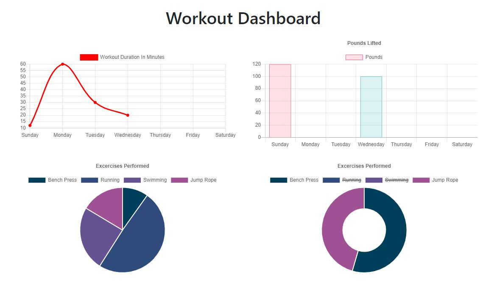
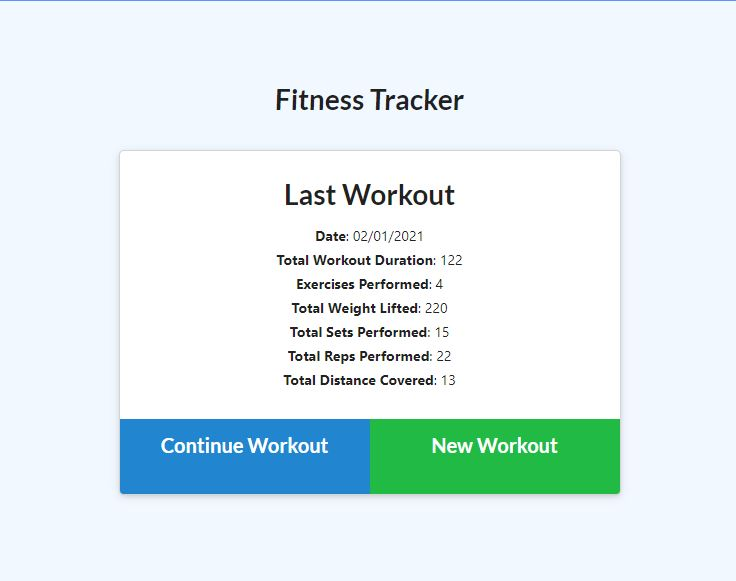

# Fitness Tracker

## Description 
  For this project, we created a workout fitness tracker. The front end was provided, but the express server, mongoose routes and schema along with a mongo database were all required to be created. 
  
  ``As a user, I want to be able to view create and track daily workouts. I want to be able to log multiple exercises in a workout on a given day. I should also be able to track the name, type, weight, sets, reps, and duration of exercise. If the exercise is a cardio exercise, I should be able to track my distance traveled.``

 

  

  

  ---
  ## Project Deployed
  To view this project working, visit https://andrewisfit.herokuapp.com/ 
    

  ---
  ## Table of Contents

  * [Installation](#installation)
  * [Usage](#usage)
  * [License](#license)
  * [Questions](#questions)

  ---
  ## Installation 
  1. In gitbash, run `git clone https://github.com/diemrbond/FitnessTracker` 
  2. Run `npm install` 
  3. Ensure you have `mongod` running

  
  ---
  ## Usage 
  1. Run `node server.js`
  2. Open `http://localhost:3000/` in your browser

  ---
  ## License 
  This application is licensed under: GNU GPLv3
  
This program is free software: you can redistribute it and/or modify it under the terms of the GNU General Public License as published by the Free Software Foundation, either version 3 of the License, or (at your option) any later version.

This program is distributed in the hope that it will be useful, but WITHOUT ANY WARRANTY; without even the implied warranty of MERCHANTABILITY or FITNESS FOR A PARTICULAR PURPOSE. See the GNU General Public License for more details.

You should have received a copy of the GNU General Public License along with this program. If not, see <https://www.gnu.org/licenses/>.

  
  ---
  ## Questions
  If you have any questions about this project, please feel free to contact me via the following information:

  

  Andrew Kelleher

  Github: https://github.com/diemrbond

  Email: [mrbondmustdie@gmail.com](mailto:mrbondmustdie@gmail.com)

  ---
  © 2020 Andrew Kelleher | diemrbond.github.io
